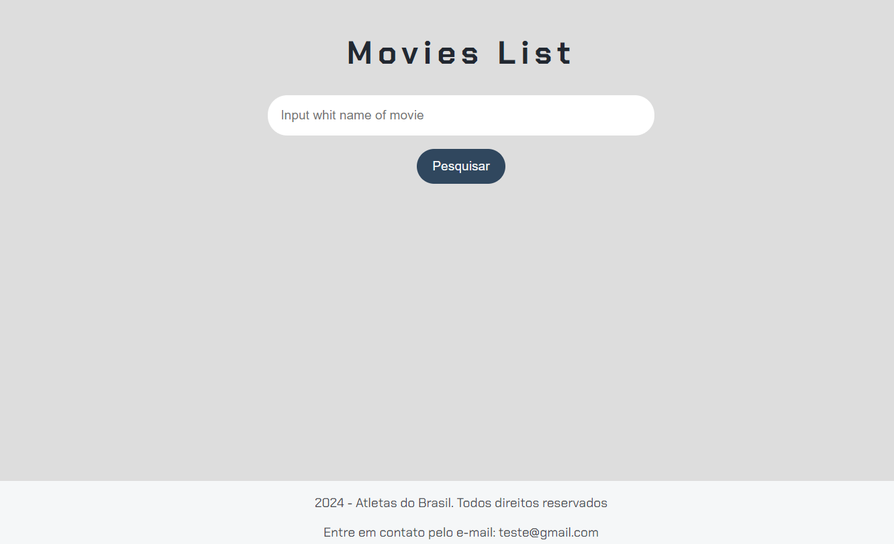
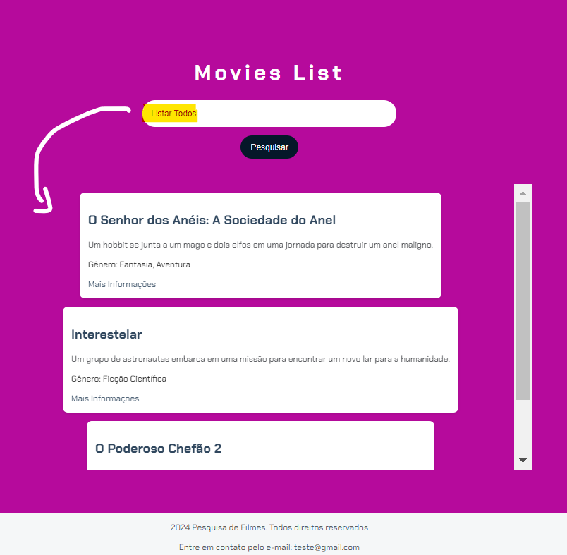

<h1>Aplicação para realizar busca de filmes</h1>

    </img>

Este projeto foi desenvolvido durante a imersão da Alura, que propôs um desafio para criar uma aplicação capaz de realizar buscas.

A base de dados do projeto foi gerada pela IA generativa Google Gemini, para realizar esses testes 

<h2>Como Utilizar?</h2>
<ol>
    <li>Abra o arquivo index.html do projeto</li>
    <li>Escreva "Listar todos", para vizualizar todos os filmes que estão registrados na base de dados.</li>
    </img>
    <li>Pesquise pelo menos um destes filmes ou o gênero dos mesmos.</li>
    </img>
</ol>

